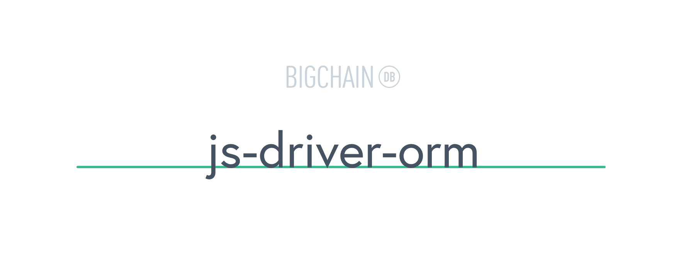

# [](https://www.bigchaindb.com)

> A CRAB-based ORM for BigchainDB.

[](https://www.npmjs.com/package/bigchaindb-orm)
[](https://codecov.io/gh/bigchaindb/js-driver-orm)
[](https://github.com/ascribe/javascript)
[](https://travis-ci.org/bigchaindb/js-driver-orm)
[](https://greenkeeper.io/)

CRAB is the CRUD model in databases applied to blockchains:

| Database   | Blockchain   |
| ---------- | ------------ |
| **C**reate | **C**reate   |
| **R**ead   | **R**etrieve |
| **U**pdate | **A**ppend   |
| **D**elete | **B**urn     |

## Breaking changes

- **Version 3.x ** of js-driver-orm changes namespacing of data storage and retrieval. Using new version with old data will brake it!

## Table of Contents

- [Setup](#setup)
- [Usage](#usage)
- [Examples](#examples)
    - [Create an asset](#example-create-an-asset)
    - [Retrieve assets](#example-retrieve-assets)
    - [Append a transaction](#example-append-a-transaction)
    - [Burn an asset](#example-burn-an-asset)
- [License](#license)

## Setup

```bash
$ npm install bigchaindb-orm
```

## Usage

```javascript
// import bigchaindb-orm
import Orm from 'bigchaindb-orm'
// connect to BigchainDB
const bdbOrm = new Orm(
    "https://test.bigchaindb.com/api/v1/",
    {
        app_id: "Get one from testnet.bigchaindb.com",
        app_key: "Get one from testnet.bigchaindb.com"
    }
)
// define(<model name>,<additional information>)
// <model name>: represents the name of model you want to store
// <additional inf.>: any information you want to pass about the model (can be string or object)
// note: cannot be changed once set!
bdbOrm.define("myModel", "https://schema.org/v1/myModel")
// create a public and private key for Alice
const aliceKeypair = new bdbOrm.driver.Ed25519Keypair()
```

## Examples

All examples need bdbOrm initialized as described in usage

### Example: Create an asset

```javascript
// from the defined models in our bdbOrm we create an asset with Alice as owner
bdbOrm.models.myModel
    .create({
        keypair: aliceKeypair,
        data: { key: 'dataValue' }
    })
    .then(asset => {
        /*
            asset is an object with all our data and functions
            asset.id equals the id of the asset
            asset.data is data of the last (unspent) transaction
            asset.transactionHistory gives the full raw transaction history
            Note: Raw transaction history has different object structure then
            asset. You can find specific data change in metadata property.
        */
        console.log(asset.id)
    })
```

### Example: Retrieve assets

```javascript
// get all objects with retrieve()
// or get a specific object with retrieve(object.id)
bdbOrm.models.myModel
    .retrieve()
    .then(assets => {
        // assets is an array of myModel
        console.log(assets.map(asset => asset.id))
    })
```

### Example: Append a transaction
> "Update" (Database) => "Append" (Blockchain)

```javascript
// create an asset with Alice as owner
bdbOrm.models.myModel
    .create({
        keypair: aliceKeypair,
        data: { key: 'dataValue' }
    })
    .then(asset => {
        // lets append update the data of our asset
        // since we use a blockchain, we can only append
        return asset.append({
            toPublicKey: aliceKeypair.publicKey,
            keypair: aliceKeypair,
            data: { key: 'updatedValue' }
        })
    })   
    .then(updatedAsset => {
        // updatedAsset contains the last (unspent) state
        // of our asset so any actions
        // need to be done to updatedAsset
        console.log(updatedAsset.data)
    })
```

### Example: Burn an asset
> "Delete" (Database) => "Burn" (Blockchain)

:exclamation:Burning assets does not delete them! It moves control of asset from users keypair to unfulfillable one.:exclamation:

```javascript
// create an asset with Alice as owner
bdbOrm.models.myModel
    .create({
        keypair: aliceKeypair,
        data: { key: 'dataValue' }
    })
    .then(asset => {
        // lets burn the asset by assigning to a random keypair
        // since will not store the private key it's infeasible to redeem the asset
        return asset.burn({
            keypair: aliceKeypair
        })
    })
    .then(burnedAsset => {
        // asset is now tagged as "burned"
        console.log(burnedAsset.data)
    })
```

## License

```
Copyright 2018 BigchainDB GmbH

Licensed under the Apache License, Version 2.0 (the "License");
you may not use this file except in compliance with the License.
You may obtain a copy of the License at

   http://www.apache.org/licenses/LICENSE-2.0

Unless required by applicable law or agreed to in writing, software
distributed under the License is distributed on an "AS IS" BASIS,
WITHOUT WARRANTIES OR CONDITIONS OF ANY KIND, either express or implied.
See the License for the specific language governing permissions and
limitations under the License.
```
